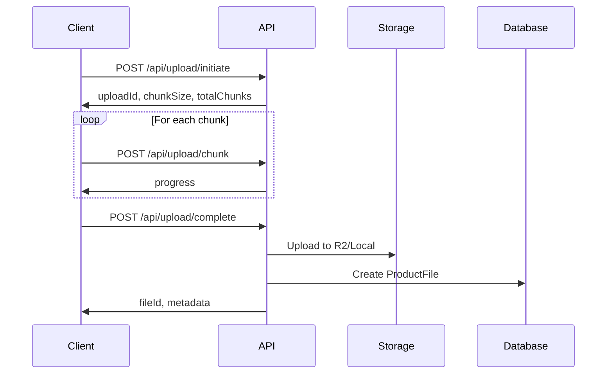
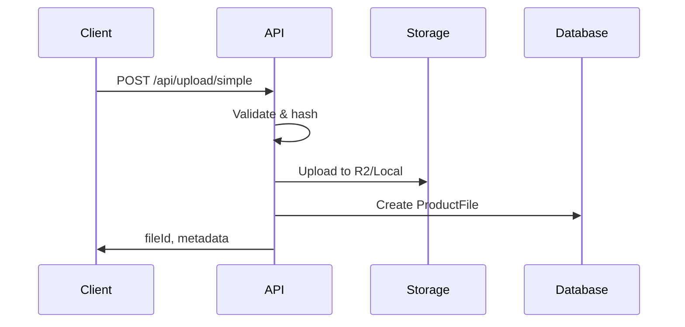

# File Upload System Documentation

## Overview

The SequenceHUB file upload system provides a production-ready, secure, and resumable file upload solution for xLights sequences and related media. The system supports both multipart chunked uploads for large files and simple direct uploads for smaller files.

## Architecture

### Components

1. **Upload API Routes** (`/src/app/api/upload/`)
   - `/initiate` - Start multipart upload session
   - `/chunk` - Upload individual chunks
   - `/complete` - Finalize and process upload
   - `/simple` - Direct upload for small files
   - `/abort` - Cancel in-progress uploads

2. **Upload Utilities** (`/src/lib/upload/`)
   - `types.ts` - TypeScript type definitions
   - `validation.ts` - File validation and security checks
   - `hash.ts` - SHA-256 and MD5 hashing utilities
   - `metadata.ts` - FSEQ/XSQ metadata extraction
   - `session.ts` - Upload session management

3. **Storage Layer** (`/src/lib/storage/`)
   - `r2.ts` - Cloudflare R2 integration
   - `local.ts` - Local filesystem fallback
   - `index.ts` - Storage abstraction layer

## Upload Workflows

### Multipart Upload (for files > 5MB)



### Simple Upload (for files ≤ 5MB)



## File Types and Validation

### Supported File Types

| FileType | Extensions | Max Size | Validation |
|----------|-----------|----------|------------|
| RENDERED | `.fseq` | 500MB | Magic bytes + metadata |
| SOURCE | `.xsq`, `.xml` | 100MB | Magic bytes + metadata |
| ASSET | `.mp3`, `.wav`, `.ogg`, `.xmodel`, `.jpg`, `.png`, `.gif` | 50MB | Extension only |
| PREVIEW | `.mp4`, `.webm`, `.mov`, `.gif` | 200MB | Extension only |

### Validation Steps

1. **Extension Validation** - Check file extension against allowed list
2. **MIME Type Check** - Validate Content-Type header
3. **File Size Limit** - Enforce type-specific size limits
4. **Magic Bytes Validation** - Verify file header matches expected type
5. **SHA-256 Hashing** - Calculate hash for deduplication
6. **Metadata Extraction** - Extract technical specs from FSEQ/XSQ files

### Security Features

- Path traversal prevention
- Magic byte verification
- Chunk hash validation
- Rate limiting ready
- Virus scan hook points
- Comprehensive audit logging
- Ownership verification

## API Reference

### POST /api/upload/initiate

Start a multipart upload session.

**Request:**
```json
{
  "fileName": "christmas-tree.fseq",
  "fileSize": 50000000,
  "mimeType": "application/octet-stream",
  "uploadType": "RENDERED",
  "productId": "optional-product-id",
  "versionId": "optional-version-id"
}
```

**Response:**
```json
{
  "uploadId": "upload_1234567890_abc123",
  "chunkSize": 5242880,
  "totalChunks": 10,
  "expiresAt": "2024-01-31T12:00:00Z"
}
```

### POST /api/upload/chunk

Upload a single chunk.

**Request (multipart/form-data):**
- `uploadId`: Upload session ID
- `chunkIndex`: Zero-based chunk index
- `chunkHash`: MD5 hash of chunk data
- `chunk`: Binary chunk data

**Response:**
```json
{
  "success": true,
  "chunkIndex": 5,
  "progress": 0.6
}
```

### POST /api/upload/complete

Finalize upload and process file.

**Request:**
```json
{
  "uploadId": "upload_1234567890_abc123"
}
```

**Response:**
```json
{
  "fileId": "clw9x8y7z0000abcd1234efgh",
  "storageKey": "rendered/1234567890-abc123-christmas-tree.fseq",
  "metadata": {
    "version": "2.0",
    "channelCount": 10000,
    "frameCount": 12000,
    "stepTime": 50,
    "sequenceLength": 600,
    "fps": 20
  },
  "deduplicated": false
}
```

### POST /api/upload/simple

Direct upload for smaller files.

**Request (multipart/form-data):**
- `file`: File binary data
- `fileType`: One of RENDERED, SOURCE, ASSET, PREVIEW
- `productId`: Optional product ID
- `versionId`: Optional version ID

**Response:** Same as `/upload/complete`

### POST /api/upload/abort

Cancel an in-progress upload.

**Request:**
```json
{
  "uploadId": "upload_1234567890_abc123"
}
```

**Response:**
```json
{
  "success": true
}
```

## Metadata Extraction

### FSEQ Files

Automatically extracted metadata:
- `version` - FSEQ format version (e.g., "2.0")
- `channelCount` - Number of channels
- `frameCount` - Number of frames
- `stepTime` - Time per frame in milliseconds
- `sequenceLength` - Total duration in seconds
- `fps` - Frames per second
- `compressionType` - Compression method used

### XSQ/XML Files

Automatically extracted metadata:
- `xLightsVersion` - xLights software version
- `mediaFile` - Associated audio file name
- `sequenceType` - Type of sequence
- `sequenceTiming` - Timing configuration
- `modelCount` - Number of models
- `effectCount` - Number of effects

## Storage Configuration

### Development (Local Storage)

Files stored in `/download` directory at project root.

**Required Environment Variables:**
```bash
DOWNLOAD_SECRET=your-download-secret-key
```

### Production (Cloudflare R2)

Files stored in R2 bucket with S3-compatible API.

**Required Environment Variables:**
```bash
R2_ENDPOINT=https://[account-id].r2.cloudflarestorage.com
R2_ACCESS_KEY_ID=your-r2-access-key-id
R2_SECRET_ACCESS_KEY=your-r2-secret-access-key
R2_BUCKET_NAME=sequencehub-files
DOWNLOAD_SECRET=your-download-secret-key
```

**Setup Instructions:**

1. Create Cloudflare R2 bucket:
   ```bash
   wrangler r2 bucket create sequencehub-files
   ```

2. Generate R2 API tokens in Cloudflare dashboard

3. Add credentials to `.env`:
   ```bash
   R2_ENDPOINT=https://[your-account-id].r2.cloudflarestorage.com
   R2_ACCESS_KEY_ID=[your-access-key]
   R2_SECRET_ACCESS_KEY=[your-secret-key]
   R2_BUCKET_NAME=sequencehub-files
   ```

## Client-Side Implementation

### Multipart Upload Example

```typescript
// Step 1: Initiate upload
const initiateResponse = await fetch('/api/upload/initiate', {
  method: 'POST',
  headers: { 'Content-Type': 'application/json' },
  body: JSON.stringify({
    fileName: file.name,
    fileSize: file.size,
    mimeType: file.type,
    uploadType: 'RENDERED',
  }),
});

const { uploadId, chunkSize, totalChunks } = await initiateResponse.json();

// Step 2: Upload chunks
for (let i = 0; i < totalChunks; i++) {
  const start = i * chunkSize;
  const end = Math.min(start + chunkSize, file.size);
  const chunk = file.slice(start, end);

  // Calculate chunk hash
  const buffer = await chunk.arrayBuffer();
  const hashBuffer = await crypto.subtle.digest('MD5', buffer);
  const chunkHash = Array.from(new Uint8Array(hashBuffer))
    .map(b => b.toString(16).padStart(2, '0'))
    .join('');

  const formData = new FormData();
  formData.append('uploadId', uploadId);
  formData.append('chunkIndex', i.toString());
  formData.append('chunkHash', chunkHash);
  formData.append('chunk', chunk);

  const response = await fetch('/api/upload/chunk', {
    method: 'POST',
    body: formData,
  });

  const { progress } = await response.json();
  console.log(`Upload progress: ${(progress * 100).toFixed(0)}%`);
}

// Step 3: Complete upload
const completeResponse = await fetch('/api/upload/complete', {
  method: 'POST',
  headers: { 'Content-Type': 'application/json' },
  body: JSON.stringify({ uploadId }),
});

const { fileId, metadata } = await completeResponse.json();
console.log('Upload complete!', fileId, metadata);
```

### Simple Upload Example

```typescript
const formData = new FormData();
formData.append('file', file);
formData.append('fileType', 'RENDERED');

const response = await fetch('/api/upload/simple', {
  method: 'POST',
  body: formData,
});

const { fileId, metadata } = await response.json();
console.log('Upload complete!', fileId, metadata);
```

## Database Schema

```prisma
model ProductFile {
  id              String   @id @default(cuid())
  versionId       String
  fileName        String
  originalName    String
  fileType        FileType
  fileSize        Int      // in bytes
  fileHash        String   // SHA256
  storageKey      String   // Path in storage
  mimeType        String?

  // File metadata (extracted during analysis)
  metadata        String?  // JSON string

  // xLights-specific metadata
  sequenceLength  Float?   // in seconds
  fps             Int?
  channelCount    Int?

  createdAt       DateTime @default(now())
  version         ProductVersion @relation(...)

  @@index([versionId])
  @@index([fileHash])
}
```

## Error Handling

All endpoints return consistent error format:

```json
{
  "error": "Error message",
  "errors": ["Detailed error 1", "Detailed error 2"],
  "warnings": ["Warning 1"]
}
```

### Common Errors

| Error | Status | Cause | Solution |
|-------|--------|-------|----------|
| `Unauthorized` | 401 | No valid JWT token | Login required |
| `Access denied` | 403 | Not file owner | Verify ownership |
| `File validation failed` | 400 | Invalid file | Check file type/size |
| `Upload session not found` | 404 | Invalid uploadId | Restart upload |
| `Chunk hash mismatch` | 400 | Data corruption | Re-upload chunk |
| `Upload session expired` | 400 | Timeout exceeded | Restart upload |

## Audit Logging

All file operations are logged to `AuditLog` table with:

- `userId` - User performing action
- `action` - FILE_UPLOADED, FILE_DELETED, SECURITY_ALERT
- `entityType` - 'upload_session', 'product_file', etc.
- `entityId` - Upload ID or file ID
- `metadata` - JSON with operation details
- `ipAddress` - Client IP
- `userAgent` - Client user agent

## Performance Considerations

### Chunking Strategy

- **Chunk Size**: 5MB (configurable)
- **Max Chunks**: ~100 for 500MB file
- **Parallelization**: Client can upload chunks in parallel (not implemented by default)
- **Resume Support**: Re-upload missing chunks only

### Deduplication

Files with identical SHA-256 hashes are automatically deduplicated:
1. Hash calculated after upload
2. Database checked for existing hash
3. If found, new file points to existing storage
4. Storage space saved

### Cleanup

- Upload sessions expire after 24 hours
- Temp files cleaned up after completion
- Run periodic cleanup job for expired sessions

## Security Best Practices

1. **Always validate on server-side** - Never trust client
2. **Use magic byte validation** - Prevent file type spoofing
3. **Enforce file size limits** - Prevent storage abuse
4. **Log security events** - Monitor for attacks
5. **Rate limit uploads** - Prevent abuse (implement per-user limits)
6. **Scan for viruses** - Integrate antivirus scanning
7. **Use signed URLs** - Prevent unauthorized downloads

## Future Enhancements

- [ ] Parallel chunk uploads
- [ ] Progress persistence (Redis)
- [ ] Virus scanning integration
- [ ] Image thumbnail generation
- [ ] Video preview generation
- [ ] Advanced metadata extraction
- [ ] Upload resume after browser close
- [ ] Bandwidth throttling
- [ ] Geographic CDN distribution

## Troubleshooting

### Uploads fail with "File integrity check failed"

**Cause:** Magic bytes don't match file extension

**Solution:** Ensure file is not corrupted and has correct extension

### Large files timeout

**Cause:** Upload session expired (24 hours)

**Solution:** Complete upload within time limit or restart

### "Upload session not found" error

**Cause:** Session was cleaned up or never created

**Solution:** Restart upload from initiation

### R2 uploads fail

**Cause:** Missing or invalid R2 credentials

**Solution:** Verify environment variables are set correctly

## Support

For issues or questions:
- Check audit logs for detailed error information
- Review security alerts in database
- Enable debug logging in upload utilities
- Contact system administrator
